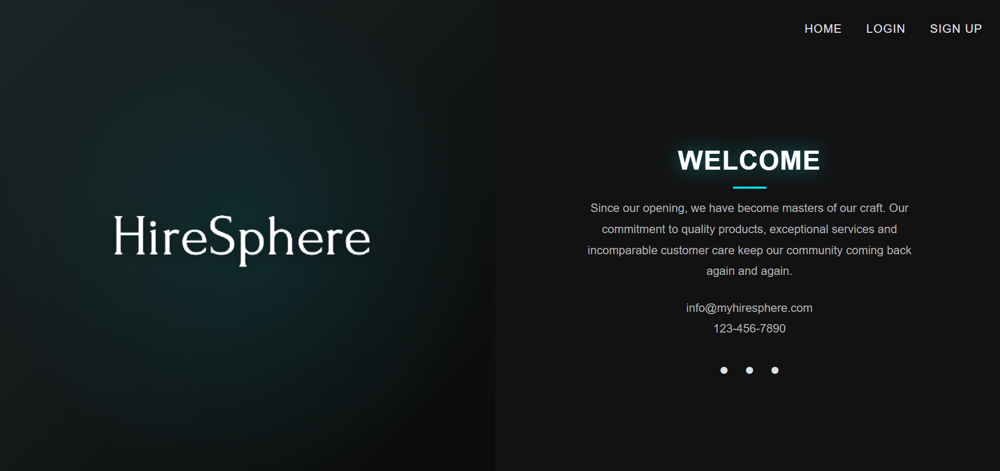
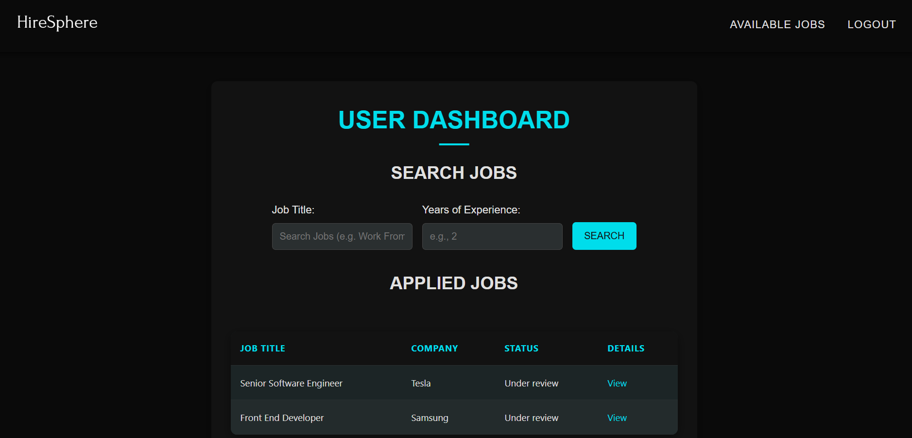
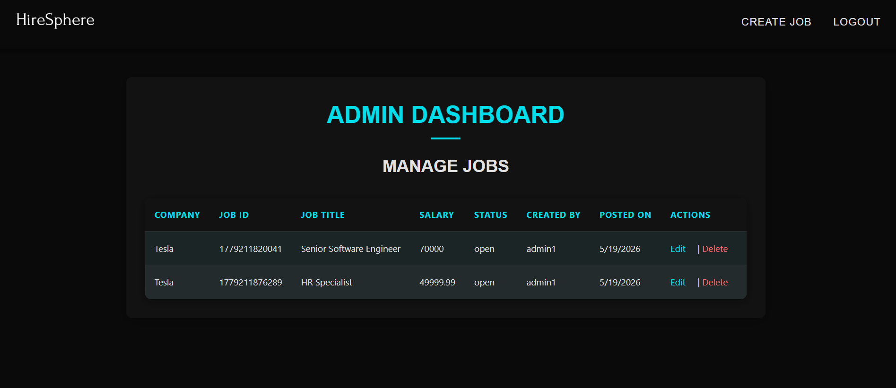
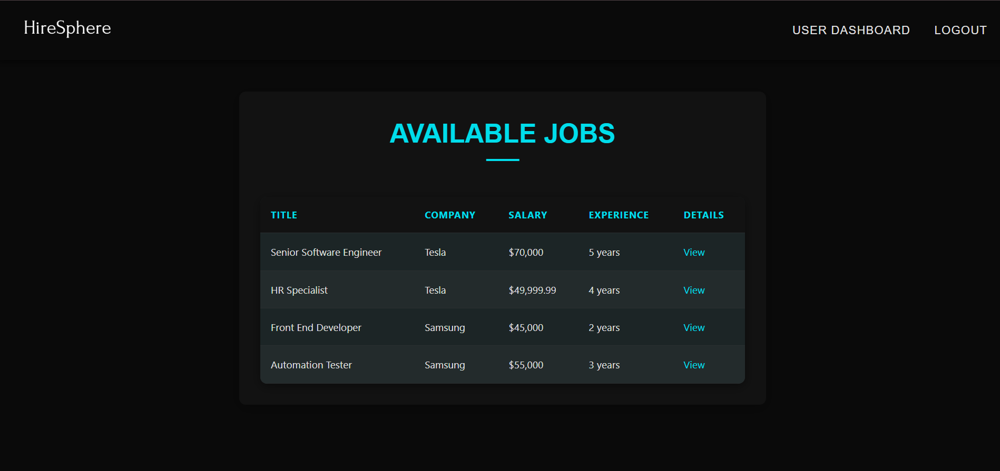

# 🚀 HireSphere - Your Gateway to Dream Jobs

<div align="center">


**A full-stack job board connecting talented individuals with great companies**

[Features](#-features) • [Tech Stack](#-tech-stack) • [Installation](#-installation) • [Screenshots](#-screenshots) • [Demo](#-demo)

</div>

---

## 📋 Table of Contents

- [About](#-about)
- [Features](#-features)
- [Tech Stack](#-tech-stack)
- [Installation](#-installation)
- [Usage](#-usage)
- [Project Structure](#-project-structure)
- [Screenshots](#-screenshots)
- [API Integration](#-api-integration)
- [Testing](#-testing)
- [Contributing](#-contributing)
- [License](#-license)
- [Team](#-team)

---

## 🎯 About

**HireSphere** is a comprehensive job search platform built with Django that bridges the gap between talented job seekers and companies looking to hire. The platform provides a seamless experience for both employers posting jobs and candidates searching for their next opportunity.

### Key Highlights
- ✨ **Dual User Roles**: Separate dashboards for companies and job seekers
- 🔍 **Smart Search**: Filter jobs by title, description, and experience level
- 📊 **Application Tracking**: Real-time status updates for job applications
- 🛡️ **Secure Authentication**: Role-based access control and data protection

---

## ✨ Features

### For Job Seekers 👤
- ✅ **User Registration & Login** - Secure authentication system
- 🔍 **Advanced Job Search** - Filter by title, description, and years of experience
- 📝 **Easy Application** - One-click job applications with resume upload
- 📊 **Track Applications** - Monitor application status (Pending/Accepted/Rejected)
- 💼 **Application History** - View all applied jobs in one place
- 📄 **Resume Upload** - Attach your resume to applications

### For Companies/Employers 🏢
- ✅ **Company Registration** - Dedicated employer accounts
- ➕ **Post Jobs** - Create detailed job listings with requirements
- ✏️ **Edit/Delete Jobs** - Manage job postings anytime
- 👥 **View Applicants** - See all candidates who applied
- ✅ **Screen Candidates** - Accept or reject applications
- 📊 **Dashboard Analytics** - Track job performance and applications

---

## 🛠️ Tech Stack

<div align="center">

| Backend | Frontend | Database | Tools |
|---------|----------|----------|-------|
|  |  |  |  |
|  |  | |  |
| |  | | |

</div>

### Key Technologies
- **Django MVT Architecture** - Clean separation of concerns
- **Django ORM** - Efficient database operations with prepared statements
- **AJAX/Fetch API** - Asynchronous data loading without page reloads
- **Server-side Validation** - Secure data handling and error prevention
- **File Upload Handling** - Secure resume and document management

---

## 📦 Installation

Clone the repository:

```bash
git clone https://github.com/YOUR_USERNAME/HireSphere.git
cd HireSphere
```

Install dependencies:

```bash
pip install -r requirements.txt
```

Run migrations:

```bash
python manage.py migrate
```

Start the server:

```bash
python manage.py runserver
```

Open in browser:

```
http://127.0.0.1:8000/
```

---

## 📸 Screenshots

### 🏠 Home Page


### 👤 User Dashboard


### 🏢 Admin Dashboard


### 💼 Available Jobs

